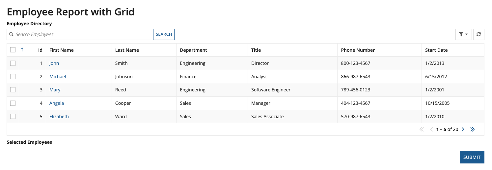
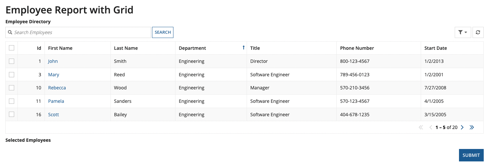
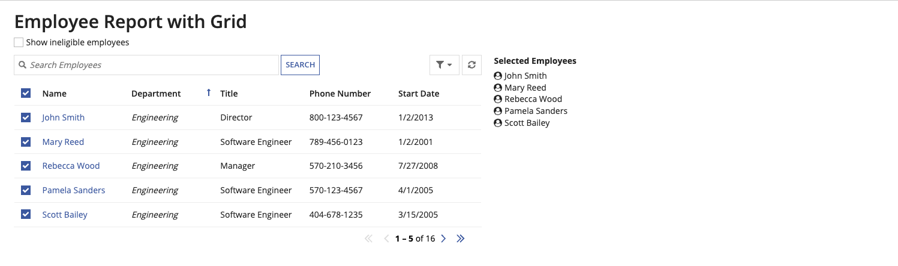
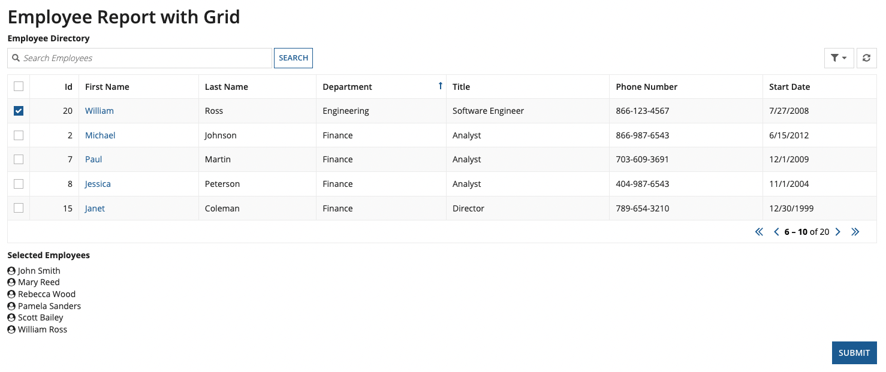
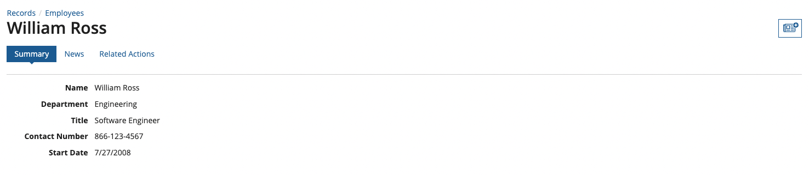

############################
Locust Test Example: Grids
############################

An example of a Locust Test showing interaction with Appian Grids - `example_locust_test_grids.py <https://gitlab.com/appian-oss/appian-locust/-/blob/master/examples/example_locust_test_grids.py>`_.

This test has a locust task defined that will interact with a read-only paging grid layout that contains an Employee directory. Configuration for this grid layout is inspired by Appian's `Grid Tutorial <https://docs.appian.com/suite/help/latest/Grid_Tutorial.html>`_.
The goal of this test is to select all Engineering employees and view the details for one of them.

The first step in this workflow is to navigate our user to a report which is backed by an interface containing the grid:

.. code-block:: python

    @task
    def interact_with_grid_in_interface(self):
        # Navigate to the interface backed report that contains a grid
        report_uiform = self.appian.visitor.visit_report(report_name="Employee Report with Grid")

The interface will look similar to this:

Now that we have navigated to the report, we will sort the grid by the *Department* field in the ascending order to have all *Engineering* department employees at the top:

.. code-block:: python

    @task
    def interact_with_grid_in_interface(self):
        # Navigate to the interface backed report that contains a grid
        report_uiform = self.appian.visitor.visit_report(report_name="Employee Report with Grid")
        
        # Sort the grid rows by the "Department" field name
        report_uiform.sort_paging_grid(label="Employee Directory", field_name="Department", ascending=True)

The interface with the sorted grid will look similar to this:

Next, we will select the first five rows on the first page of the grid:

.. code-block:: python

    @task
    def interact_with_grid_in_interface(self):
        # Navigate to the interface backed report that contains a grid
        report_uiform = self.appian.visitor.visit_report(report_name="Employee Report with Grid")
        
        # Sort the grid rows by the "Department" field name
        report_uiform.sort_paging_grid(label="Employee Directory", field_name="Department", ascending=True)

        # Select the first five rows on the first page of the grid
        report_uiform.select_rows_in_grid(rows=[0,1,2,3,4], label="Employee Directory")

Because the grid is configured to show the selected rows under *Selected Employees*, the resultant interface will look similar to this:

During development, this would be a good way to test the selection using the JSON response from the above request. Next, we will move to the second page of the grid and select the first row since it also contains an *Engineering* employee:

.. code-block:: python

    @task
    def interact_with_grid_in_interface(self):
        # Navigate to the interface backed report that contains a grid
        report_uiform = self.appian.visitor.visit_report(report_name="Employee Report with Grid")
        
        # Sort the grid rows by the "Department" field name
        report_uiform.sort_paging_grid(label="Employee Directory", field_name="Department", ascending=True)

        # Select the first five on the first page of the grid
        report_uiform.select_rows_in_grid(rows=[0,1,2,3,4], label="Employee Directory")

        # Move to the second page of the grid
        report_uiform.move_to_right_in_paging_grid(label="Employee Directory")

        # Select the first row on the second page of the grid
        report_uiform.select_rows_in_grid(rows=[0], label="Employee Directory", append_to_existing_selected=True)

The interface will look similar to this:

The grid contains a *First Name* column which is a link to the employee record. Finally, we will click on the link for an employee *William*:

.. code-block:: python

    @task
    def interact_with_grid_in_interface(self):
        # Navigate to the interface backed report that contains a grid
        report_uiform = self.appian.visitor.visit_report(report_name="Employee Report with Grid")
        
        # Sort the grid rows by the "Department" field name
        report_uiform.sort_paging_grid(label="Employee Directory", field_name="Department", ascending=True)

        # Select the first five on the first page of the grid
        report_uiform.select_rows_in_grid(rows=[0,1,2,3,4], label="Employee Directory")

        # Move to the second page of the grid
        report_uiform.move_to_right_in_paging_grid(label="Employee Directory")

        # Select the first row on the second page of the grid
        report_uiform.select_rows_in_grid(rows=[0], label="Employee Directory", append_to_existing_selected=True)

        # Click on the row with a record link with the given label
        report_uiform.click_record_link(label="William")

The user will be navigated to the employee's record which will look similar to this:

You can see a full version of this locust test `here <https://gitlab.com/appian-oss/appian-locust/-/blob/master/examples/example_locust_test_grids.py>`_. There are other useful functions for interacting with grids that can be found in our `documentation <https://appian-locust.readthedocs.io/en/latest/_api/modules/uiform.html>`_.